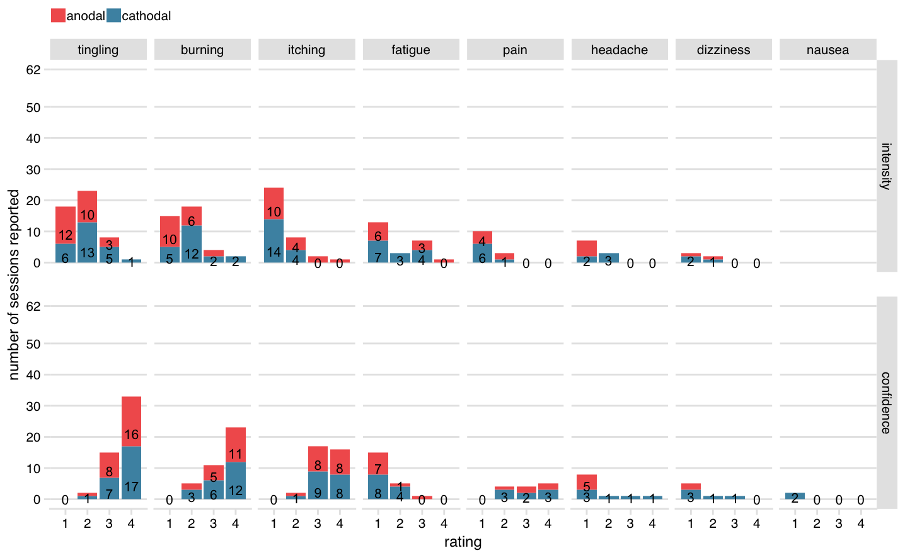

# (APPENDIX) Appendix {-}
\cleardoublepage
\phantomsection
\addcontentsline{toc}{part}{Appendices}
\appendixpage*
\setlength\beforechapskip{-\baselineskip}

# Supplement to Chapter 3 {#sacc-tDCS-supplement}

## tDCS adverse effects

\begingroup
\renewcommand{\arraystretch}{1.25}
\setlength{\LTleft}{-20cm plus -1fill}
\setlength{\LTright}{\LTleft}

<table class="table table-striped" style="font-size: 12px; margin-left: auto; margin-right: auto;">
<caption style="font-size: initial !important;">(\#tab:tab-sacc-tDCS-AE)Number of reports of tDCS adverse effects</caption>
 <thead>
<tr>
<th style="border-bottom:hidden" colspan="1"></th>
<th style="border-bottom:hidden; padding-bottom:0; padding-left:3px;padding-right:3px;text-align: center; " colspan="5">
Intensity ratinga

</th>
<th style="border-bottom:hidden; padding-bottom:0; padding-left:3px;padding-right:3px;text-align: center; " colspan="5">
Confidence ratingb

</th>
</tr>
  <tr>
   <th style="text-align:left;">   </th>
   <th style="text-align:right;"> none </th>
   <th style="text-align:right;"> a little </th>
   <th style="text-align:right;"> mode- rate </th>
   <th style="text-align:right;"> strong </th>
   <th style="text-align:right;"> very strong </th>
   <th style="text-align:right;"> n/a </th>
   <th style="text-align:right;"> un- likely </th>
   <th style="text-align:right;"> possi- bly </th>
   <th style="text-align:right;"> likely </th>
   <th style="text-align:right;"> very likely </th>
  </tr>
 </thead>
<tbody>
  <tr grouplength="8"><td colspan="11" style="border-bottom: 1px solid;"><strong>anodal session</strong></td></tr>
<tr>
   <td style="text-align:left; padding-left: 2em;" indentlevel="1"> burning </td>
   <td style="text-align:right;"> 12 </td>
   <td style="text-align:right;"> 10 </td>
   <td style="text-align:right;"> 6 </td>
   <td style="text-align:right;"> 2 </td>
   <td style="text-align:right;"> 0 </td>
   <td style="text-align:right;"> 12 </td>
   <td style="text-align:right;"> 0 </td>
   <td style="text-align:right;"> 2 </td>
   <td style="text-align:right;"> 5 </td>
   <td style="text-align:right;"> 11 </td>
  </tr>
  <tr>
   <td style="text-align:left; padding-left: 2em;" indentlevel="1"> dizziness </td>
   <td style="text-align:right;"> 28 </td>
   <td style="text-align:right;"> 1 </td>
   <td style="text-align:right;"> 1 </td>
   <td style="text-align:right;"> 0 </td>
   <td style="text-align:right;"> 0 </td>
   <td style="text-align:right;"> 28 </td>
   <td style="text-align:right;"> 2 </td>
   <td style="text-align:right;"> 0 </td>
   <td style="text-align:right;"> 0 </td>
   <td style="text-align:right;"> 0 </td>
  </tr>
  <tr>
   <td style="text-align:left; padding-left: 2em;" indentlevel="1"> fatigue </td>
   <td style="text-align:right;"> 20 </td>
   <td style="text-align:right;"> 6 </td>
   <td style="text-align:right;"> 0 </td>
   <td style="text-align:right;"> 3 </td>
   <td style="text-align:right;"> 1 </td>
   <td style="text-align:right;"> 21 </td>
   <td style="text-align:right;"> 7 </td>
   <td style="text-align:right;"> 1 </td>
   <td style="text-align:right;"> 1 </td>
   <td style="text-align:right;"> 0 </td>
  </tr>
  <tr>
   <td style="text-align:left; padding-left: 2em;" indentlevel="1"> headache </td>
   <td style="text-align:right;"> 25 </td>
   <td style="text-align:right;"> 5 </td>
   <td style="text-align:right;"> 0 </td>
   <td style="text-align:right;"> 0 </td>
   <td style="text-align:right;"> 0 </td>
   <td style="text-align:right;"> 25 </td>
   <td style="text-align:right;"> 5 </td>
   <td style="text-align:right;"> 0 </td>
   <td style="text-align:right;"> 0 </td>
   <td style="text-align:right;"> 0 </td>
  </tr>
  <tr>
   <td style="text-align:left; padding-left: 2em;" indentlevel="1"> itching </td>
   <td style="text-align:right;"> 13 </td>
   <td style="text-align:right;"> 10 </td>
   <td style="text-align:right;"> 4 </td>
   <td style="text-align:right;"> 2 </td>
   <td style="text-align:right;"> 1 </td>
   <td style="text-align:right;"> 13 </td>
   <td style="text-align:right;"> 0 </td>
   <td style="text-align:right;"> 1 </td>
   <td style="text-align:right;"> 8 </td>
   <td style="text-align:right;"> 8 </td>
  </tr>
  <tr>
   <td style="text-align:left; padding-left: 2em;" indentlevel="1"> nausea </td>
   <td style="text-align:right;"> 30 </td>
   <td style="text-align:right;"> 0 </td>
   <td style="text-align:right;"> 0 </td>
   <td style="text-align:right;"> 0 </td>
   <td style="text-align:right;"> 0 </td>
   <td style="text-align:right;"> 30 </td>
   <td style="text-align:right;"> 0 </td>
   <td style="text-align:right;"> 0 </td>
   <td style="text-align:right;"> 0 </td>
   <td style="text-align:right;"> 0 </td>
  </tr>
  <tr>
   <td style="text-align:left; padding-left: 2em;" indentlevel="1"> pain </td>
   <td style="text-align:right;"> 24 </td>
   <td style="text-align:right;"> 4 </td>
   <td style="text-align:right;"> 2 </td>
   <td style="text-align:right;"> 0 </td>
   <td style="text-align:right;"> 0 </td>
   <td style="text-align:right;"> 25 </td>
   <td style="text-align:right;"> 0 </td>
   <td style="text-align:right;"> 1 </td>
   <td style="text-align:right;"> 2 </td>
   <td style="text-align:right;"> 2 </td>
  </tr>
  <tr>
   <td style="text-align:left; padding-left: 2em;" indentlevel="1"> tingling </td>
   <td style="text-align:right;"> 5 </td>
   <td style="text-align:right;"> 12 </td>
   <td style="text-align:right;"> 10 </td>
   <td style="text-align:right;"> 3 </td>
   <td style="text-align:right;"> 0 </td>
   <td style="text-align:right;"> 5 </td>
   <td style="text-align:right;"> 0 </td>
   <td style="text-align:right;"> 1 </td>
   <td style="text-align:right;"> 8 </td>
   <td style="text-align:right;"> 16 </td>
  </tr>
  <tr grouplength="8"><td colspan="11" style="border-bottom: 1px solid;"><strong>cathodal session</strong></td></tr>
<tr>
   <td style="text-align:left; padding-left: 2em;" indentlevel="1"> burning </td>
   <td style="text-align:right;"> 11 </td>
   <td style="text-align:right;"> 5 </td>
   <td style="text-align:right;"> 12 </td>
   <td style="text-align:right;"> 2 </td>
   <td style="text-align:right;"> 2 </td>
   <td style="text-align:right;"> 11 </td>
   <td style="text-align:right;"> 0 </td>
   <td style="text-align:right;"> 3 </td>
   <td style="text-align:right;"> 6 </td>
   <td style="text-align:right;"> 12 </td>
  </tr>
  <tr>
   <td style="text-align:left; padding-left: 2em;" indentlevel="1"> dizziness </td>
   <td style="text-align:right;"> 29 </td>
   <td style="text-align:right;"> 2 </td>
   <td style="text-align:right;"> 1 </td>
   <td style="text-align:right;"> 0 </td>
   <td style="text-align:right;"> 0 </td>
   <td style="text-align:right;"> 27 </td>
   <td style="text-align:right;"> 3 </td>
   <td style="text-align:right;"> 1 </td>
   <td style="text-align:right;"> 1 </td>
   <td style="text-align:right;"> 0 </td>
  </tr>
  <tr>
   <td style="text-align:left; padding-left: 2em;" indentlevel="1"> fatigue </td>
   <td style="text-align:right;"> 18 </td>
   <td style="text-align:right;"> 7 </td>
   <td style="text-align:right;"> 3 </td>
   <td style="text-align:right;"> 4 </td>
   <td style="text-align:right;"> 0 </td>
   <td style="text-align:right;"> 20 </td>
   <td style="text-align:right;"> 8 </td>
   <td style="text-align:right;"> 4 </td>
   <td style="text-align:right;"> 0 </td>
   <td style="text-align:right;"> 0 </td>
  </tr>
  <tr>
   <td style="text-align:left; padding-left: 2em;" indentlevel="1"> headache </td>
   <td style="text-align:right;"> 27 </td>
   <td style="text-align:right;"> 2 </td>
   <td style="text-align:right;"> 3 </td>
   <td style="text-align:right;"> 0 </td>
   <td style="text-align:right;"> 0 </td>
   <td style="text-align:right;"> 26 </td>
   <td style="text-align:right;"> 3 </td>
   <td style="text-align:right;"> 1 </td>
   <td style="text-align:right;"> 1 </td>
   <td style="text-align:right;"> 1 </td>
  </tr>
  <tr>
   <td style="text-align:left; padding-left: 2em;" indentlevel="1"> itching </td>
   <td style="text-align:right;"> 14 </td>
   <td style="text-align:right;"> 14 </td>
   <td style="text-align:right;"> 4 </td>
   <td style="text-align:right;"> 0 </td>
   <td style="text-align:right;"> 0 </td>
   <td style="text-align:right;"> 14 </td>
   <td style="text-align:right;"> 0 </td>
   <td style="text-align:right;"> 1 </td>
   <td style="text-align:right;"> 9 </td>
   <td style="text-align:right;"> 8 </td>
  </tr>
  <tr>
   <td style="text-align:left; padding-left: 2em;" indentlevel="1"> nausea </td>
   <td style="text-align:right;"> 32 </td>
   <td style="text-align:right;"> 0 </td>
   <td style="text-align:right;"> 0 </td>
   <td style="text-align:right;"> 0 </td>
   <td style="text-align:right;"> 0 </td>
   <td style="text-align:right;"> 30 </td>
   <td style="text-align:right;"> 2 </td>
   <td style="text-align:right;"> 0 </td>
   <td style="text-align:right;"> 0 </td>
   <td style="text-align:right;"> 0 </td>
  </tr>
  <tr>
   <td style="text-align:left; padding-left: 2em;" indentlevel="1"> pain </td>
   <td style="text-align:right;"> 25 </td>
   <td style="text-align:right;"> 6 </td>
   <td style="text-align:right;"> 1 </td>
   <td style="text-align:right;"> 0 </td>
   <td style="text-align:right;"> 0 </td>
   <td style="text-align:right;"> 24 </td>
   <td style="text-align:right;"> 0 </td>
   <td style="text-align:right;"> 3 </td>
   <td style="text-align:right;"> 2 </td>
   <td style="text-align:right;"> 3 </td>
  </tr>
  <tr>
   <td style="text-align:left; padding-left: 2em;" indentlevel="1"> tingling </td>
   <td style="text-align:right;"> 7 </td>
   <td style="text-align:right;"> 6 </td>
   <td style="text-align:right;"> 13 </td>
   <td style="text-align:right;"> 5 </td>
   <td style="text-align:right;"> 1 </td>
   <td style="text-align:right;"> 7 </td>
   <td style="text-align:right;"> 0 </td>
   <td style="text-align:right;"> 1 </td>
   <td style="text-align:right;"> 7 </td>
   <td style="text-align:right;"> 17 </td>
  </tr>
</tbody>
<tfoot>
<tr><td style="padding: 0; border: 0;" colspan="100%">
a "To which degree were the following sensations present during stimulation?"</td></tr>
<tr><td style="padding: 0; border: 0;" colspan="100%">
b "To which degree do you believe this was caused by the stimulation?"</td></tr>
</tfoot>
</table>

\endgroup

\newpage
\pagestyle{empty}
\changetext{}{}{-25mm}{}{}
\blandscape

(\#fig:fig-sacc-tDCS-AE)(ref:caption-fig-sacc-tDCS-AE)

(ref:caption-fig-sacc-tDCS-AE) __tDCS adverse effects in Chapter \@ref(sacc-tDCS)__. Number of reports out of 62 sessions (either anodal or cathodal tDCS). Top row shows intensity ratings [_little, moderate, strong, very strong_]; bottom row shows participant's confidence that event was related to tDCS [_unlikely, possibly, likely, very likely_]. Adverse effects are sorted in descending order of number of reports (for very rare events (five reports or fewer for a given polarity), some text counts have been removed to prevent overlap).

\newpage
\elandscape
\changetext{}{}{+25mm}{}{}
\pagestyle{\defstyle}

## MNI coordinates

<table class="table table-striped" style="font-size: 12px; margin-left: auto; margin-right: auto;">
<caption style="font-size: initial !important;">(\#tab:tab-sacc-tDCS-MNI)Individual MNI coordinates of the right frontal eye field.</caption>
 <thead>
  <tr>
   <th style="text-align:center;"> participant </th>
   <th style="text-align:right;"> X </th>
   <th style="text-align:right;"> Y </th>
   <th style="text-align:right;"> Z </th>
   <th style="text-align:center;"> participant </th>
   <th style="text-align:right;"> X </th>
   <th style="text-align:right;"> Y </th>
   <th style="text-align:right;"> Z </th>
  </tr>
 </thead>
<tbody>
  <tr>
   <td style="text-align:center;"> 1 </td>
   <td style="text-align:right;"> 29.4 </td>
   <td style="text-align:right;"> 1.1 </td>
   <td style="text-align:right;"> 54.9 </td>
   <td style="text-align:center;border-left:1px solid;"> 14 </td>
   <td style="text-align:right;"> 37.5 </td>
   <td style="text-align:right;"> -1.6 </td>
   <td style="text-align:right;"> 52.6 </td>
  </tr>
  <tr>
   <td style="text-align:center;"> 2 </td>
   <td style="text-align:right;"> 33.0 </td>
   <td style="text-align:right;"> -2.2 </td>
   <td style="text-align:right;"> 50.4 </td>
   <td style="text-align:center;border-left:1px solid;"> 15 </td>
   <td style="text-align:right;"> 31.8 </td>
   <td style="text-align:right;"> -8.4 </td>
   <td style="text-align:right;"> 59.0 </td>
  </tr>
  <tr>
   <td style="text-align:center;"> 3 </td>
   <td style="text-align:right;"> 30.6 </td>
   <td style="text-align:right;"> -1.5 </td>
   <td style="text-align:right;"> 50.6 </td>
   <td style="text-align:center;border-left:1px solid;"> 16 </td>
   <td style="text-align:right;"> 31.0 </td>
   <td style="text-align:right;"> -5.1 </td>
   <td style="text-align:right;"> 54.3 </td>
  </tr>
  <tr>
   <td style="text-align:center;"> 4 </td>
   <td style="text-align:right;"> 25.7 </td>
   <td style="text-align:right;"> -3.8 </td>
   <td style="text-align:right;"> 56.4 </td>
   <td style="text-align:center;border-left:1px solid;"> 17 </td>
   <td style="text-align:right;"> 35.0 </td>
   <td style="text-align:right;"> 8.4 </td>
   <td style="text-align:right;"> 49.8 </td>
  </tr>
  <tr>
   <td style="text-align:center;"> 5 </td>
   <td style="text-align:right;"> 29.8 </td>
   <td style="text-align:right;"> -5.2 </td>
   <td style="text-align:right;"> 55.8 </td>
   <td style="text-align:center;border-left:1px solid;"> 18 </td>
   <td style="text-align:right;"> 28.1 </td>
   <td style="text-align:right;"> -3.8 </td>
   <td style="text-align:right;"> 52.8 </td>
  </tr>
  <tr>
   <td style="text-align:center;"> 6 </td>
   <td style="text-align:right;"> 29.8 </td>
   <td style="text-align:right;"> -1.1 </td>
   <td style="text-align:right;"> 58.3 </td>
   <td style="text-align:center;border-left:1px solid;"> 19 </td>
   <td style="text-align:right;"> 41.2 </td>
   <td style="text-align:right;"> -1.7 </td>
   <td style="text-align:right;"> 47.6 </td>
  </tr>
  <tr>
   <td style="text-align:center;"> 7 </td>
   <td style="text-align:right;"> 38.1 </td>
   <td style="text-align:right;"> 3.0 </td>
   <td style="text-align:right;"> 46.0 </td>
   <td style="text-align:center;border-left:1px solid;"> 20 </td>
   <td style="text-align:right;"> 37.3 </td>
   <td style="text-align:right;"> -0.9 </td>
   <td style="text-align:right;"> 43.4 </td>
  </tr>
  <tr>
   <td style="text-align:center;"> 8 </td>
   <td style="text-align:right;"> 31.5 </td>
   <td style="text-align:right;"> 0.5 </td>
   <td style="text-align:right;"> 45.6 </td>
   <td style="text-align:center;border-left:1px solid;"> 21 </td>
   <td style="text-align:right;"> 34.3 </td>
   <td style="text-align:right;"> -2.9 </td>
   <td style="text-align:right;"> 49.2 </td>
  </tr>
  <tr>
   <td style="text-align:center;"> 9 </td>
   <td style="text-align:right;"> 28.5 </td>
   <td style="text-align:right;"> 3.6 </td>
   <td style="text-align:right;"> 51.3 </td>
   <td style="text-align:center;border-left:1px solid;"> 22 </td>
   <td style="text-align:right;"> 27.7 </td>
   <td style="text-align:right;"> -10.1 </td>
   <td style="text-align:right;"> 51.0 </td>
  </tr>
  <tr>
   <td style="text-align:center;"> 10 </td>
   <td style="text-align:right;"> 28.1 </td>
   <td style="text-align:right;"> -1.9 </td>
   <td style="text-align:right;"> 50.7 </td>
   <td style="text-align:center;border-left:1px solid;"> 23 </td>
   <td style="text-align:right;"> 30.3 </td>
   <td style="text-align:right;"> -5.3 </td>
   <td style="text-align:right;"> 55.3 </td>
  </tr>
  <tr>
   <td style="text-align:center;"> 11 </td>
   <td style="text-align:right;"> 30.6 </td>
   <td style="text-align:right;"> -3.8 </td>
   <td style="text-align:right;"> 52.0 </td>
   <td style="text-align:center;border-left:1px solid;"> 24 </td>
   <td style="text-align:right;"> 26.8 </td>
   <td style="text-align:right;"> -3.9 </td>
   <td style="text-align:right;"> 54.6 </td>
  </tr>
  <tr>
   <td style="text-align:center;"> 12 </td>
   <td style="text-align:right;"> 36.5 </td>
   <td style="text-align:right;"> -0.4 </td>
   <td style="text-align:right;"> 46.8 </td>
   <td style="text-align:center;border-left:1px solid;"> 25 </td>
   <td style="text-align:right;"> 29.0 </td>
   <td style="text-align:right;"> 4.9 </td>
   <td style="text-align:right;"> 49.1 </td>
  </tr>
  <tr>
   <td style="text-align:center;"> 13 </td>
   <td style="text-align:right;"> 26.2 </td>
   <td style="text-align:right;"> -1.1 </td>
   <td style="text-align:right;"> 54.7 </td>
   <td style="text-align:center;border-left:1px solid;"> 26 </td>
   <td style="text-align:right;"> 30.3 </td>
   <td style="text-align:right;"> -3.9 </td>
   <td style="text-align:right;"> 50.9 </td>
  </tr>
</tbody>
</table>
