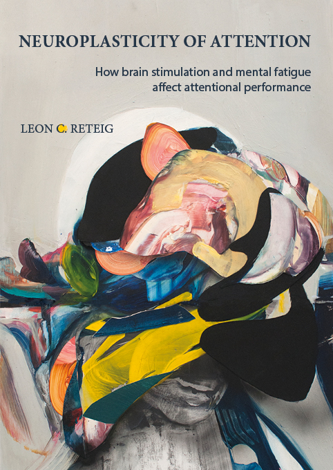

---
output:
  github_document:
    html_preview: false
---

<!-- README.md is generated from _README.Rmd. Please edit that file 
Code to generate: rmarkdown::render("_README.Rmd", output_file = "README.md", output_format = "github_document") -->

```{r, include = FALSE}
knitr::opts_chunk$set(
  collapse = TRUE,
  comment = ""
  #fig.path = "man/figures/README-",
  #out.width = "100%"
)
```

# Neuroplasticity of attention: How brain stimulation and mental fatigue affect attentional performance 



<!-- badges: start -->
[](https://travis-ci.com/lcreteig/thesis)
[](https://creativecommons.org/licenses/by/4.0)
[](https://doi.org/)
<!-- badges: end -->

These are the source files for the PhD thesis of [Leon Reteig](https://lcreteig.github.io). View the [html](https://lcreteig.github.io/thesis) and [pdf](https://lcreteig.github.io/thesis/thesis.pdf) version at <https://lcreteig.github.io/thesis>.

* __Institution__: [Department of Psychology](https://psyres.uva.nl/), University of Amsterdam
* __Advisors__:
    1. Prof. Dr. [Heleen A. Slagter](https://www.heleenslagter.com/) 
    2. Prof. Dr. [K. Richard Ridderinkhof](https://www.uva.nl/en/profile/r/i/k.r.ridderinkhof/k.r.ridderinkhof.html)
* __Defense date__: 20 November 2019

## Summary

Attention allows us to focus on what is relevant and to ignore what is not. While we call upon attention at every waking moment, it is not static: we cannot sustain attention indefinitely, and often fall prey to distractions. This PhD thesis is a study of the short-term _neuroplasticity_ of attentional processes: how susceptible is attention to change (_plasticity_), and what processes in the brain give rise to changes in attention (_neuro_)? In Chapters 2--5, I examined whether attention can be improved with electrical stimulation of the brain, in the form of transcranial Direct Current Stimulation (tDCS). Previous studies that attempted to use tDCS to enhance attention have yielded promising, but inconsistent results (reviewed in Chapter 2). My attempt to enhance _spatial_ attention with tDCS (Chapter 3) was unsuccessful, as stimulation of the frontal eye fields did not lead to changes in eye movements. Applying tDCS over the dorsolateral prefrontal cortex also did not enhance _temporal_ attention (Chapters 4 and 5), as participants' performance on an attentional blink task remained unchanged. In Chapter 6, I investigated the opposite effect: decreases in attention, when attention has to be _sustained_ for a long time. Using EEG, I tracked whether similar decreases occurred in different attention-related signals in the brain. tDCS may one day be used to counteract these declines, or to relieve other deficits in attention. However, barring a deeper understanding of the technique and more large-scale studies of its efficacy, such practical applications of tDCS are not yet feasible.

## Chapters

### Chapter 2

Reteig, L. C., Talsma, L. J., van Schouwenburg, M. R., & Slagter, H. A. (2017). Transcranial Electrical Stimulation as a Tool to Enhance Attention. _Journal of Cognitive Enhancement, 1_, 10--25. <https://doi.org/10.1007/s41465-017-0010-y>

| <!-- -->    | <!-- -->                                                        |
|-------------|-----------------------------------------------------------------|
| Materials   | [Open Science Framework](https://doi.org/10.17605/OSF.IO/KQVAP) |

### Chapter 3

Reteig, L. C., Knapen, T., Roelofs, F. J. F. W., Ridderinkhof, K. R., & Slagter, H. A. (2018). No evidence that frontal eye field tDCS affects latency or accuracy of prosaccades. _Frontiers in Neuroscience_ 12:617. <https://doi.org/10.3389/fnins.2018.00617>

| <!-- -->        | <!-- -->                                            |
|-----------------|-----------------------------------------------------|
| Project website | <https://lcreteig.github.io/sacc-tDCS>              |
| Data            | [figshare](https://doi.org/10.21942/uva.6462770.v1) |
| Code            | [GitHub](https://doi.org/10.5281/zenodo.1410502)    |
| Materials       | [OSF](https://doi.org/10.17605/OSF.IO/8JPV9)        |

### Chapter 4

Reteig, L. C., Newman, L. A., Ridderinkhof, K. R., & Slagter, H. A. (n.d.). Effects of tDCS on the attentional blink revisited: A statistical evaluation of a replication attempt.

| <!-- -->        | <!-- -->                                                         |
|-----------------|------------------------------------------------------------------|
| Project website | <https://lcreteig.github.io/AB-tDCS>                             |
| Behavioral data | [OSF](https://doi.org/10.17605/OSF.IO/RJU7F)                     |
| EEG data        | [OpenNeuro](https://doi.org/10.18112/openneuro.ds001810.v1.1.0)  |
| Code            | [GitHub](https://doi.org/10.5281/zenodo.3233872)                 | 
| Materials       | [OSF](https://doi.org/10.17605/OSF.IO/Y6HSF)                     |

### Chapter 5

Reteig, L. C., Newman, L. A., Ridderinkhof, K. R., & Slagter, H. A. (n.d.). Spontaneous eye blink rate does not predict attentional blink size, nor the effects of tDCS on attentional blink size.

| <!-- -->        | <!-- -->                                         |
|-----------------|--------------------------------------------------|
| Project website | <https://lcreteig.github.io/AB_tDCS-sEBR>        |
| Data            | [OSF](https://doi.org/10.17605/OSF.IO/CW2MA)     |
| Code            | [OSF](https://doi.org/10.17605/OSF.IO/BMP7S)  | 
| Materials       | [OSF](https://doi.org/10.17605/OSF.IO/PZBGY)     |

### Chapter 6

Reteig, L. C., van den Brink, R. L., Prinssen, S., Cohen, M. X., & Slagter, H. A. (2019). Sustaining attention for a prolonged period of time increases temporal variability in cortical responses. *Cortex, 117*, 16--32. <https://doi.org/10.1016/j.cortex.2019.02.016>

| <!-- -->        | <!-- -->                                     |
|-----------------|----------------------------------------------|
| Project website | <https://lcreteig.github.io/MFBrain>         |
| Data            | [OSF](https://doi.org/10.17605/OSF.IO/456HE) |
| Code            | [OSF](https://doi.org/10.17605/OSF.IO/BNWAP) | 
| Materials       | [OSF](https://doi.org/10.17605/OSF.IO/RZJ2V) |

## Usage

### Setup

1. Click on `Clone or download` > `Download ZIP` and download and unzip the files. Or just clone the repository:

```{bash, eval = FALSE}
git clone https://github.com/lcreteig/thesis
```

2. I'd recommend to open the `thesis.Rproj` file using [RStudio](https://www.rstudio.com). If you're not using RStudio, you'll need another means to run the R code, set your working directory to the root of the `/thesis` folder, and you'll also need an installation of [`pandoc`](https://pandoc.org/)

3. Install the required R packages if you don't have them:

```{r, eval = FALSE}
# from CRAN
install.packages(c("tidyverse", "pander", "kableExtra"))

# from GitHub
if (!require("devtools")) install.packages("devtools", repos = "http://cran.rstudio.org")
remotes::install_github("rstudio/bookdown")
remotes::install_github("crsh/papaja")
```

4. If you want to recreate the `pdf` version of the thesis, you'll also need a LaTeX distribution. If you don't have one yet, I recommend [TinyTex](https://yihui.name/tinytex/). It's quite a miminal distribution, but while rendering the book it will automatically install any extra LaTeX packages you might need. To install TinyTex through R: 

```{r, eval = FALSE}
install.packages('tinytex')
tinytex::install_tinytex()
# after restarting RStudio, confirm that the LaTeX distribution is now available:
tinytex:::is_tinytex()
```

The pdf is typeset with the "Helvetica" and "Minion Pro" typefaces. They are commercial fonts, and so cannot be distributed here. If you don't have these fonts installed on your system, make sure to delete lines 27--32 in `tex/preamble.tex`:

```latex
%% Typefaces
\usepackage{fontspec}
\setmainfont{Minion Pro}
\setsansfont[Ligatures=TeX]{Helvetica}
\setmathsfont(Digits,Greek,Latin)[Numbers={Proportional}]{Minion Pro}
\setmathrm{Minion Pro}
```

### Building the thesis

5. If using RStudio, click "Build Book" from the "Build" pane. Select `bookdown::gitbook` to create the html version, `bookdown::pdf_book` to create the pdf version, or "All Formats" to build both. If not using RStudio, run the following code:

```{r, eval = FALSE}
bookdown::render_book("index.Rmd", "bookdown::gitbook") # html version
bookdown::render_book("index.Rmd", "bookdown::pdf_book") # PDF version
```

6. If not done automatically, navigate to the newly created `_book` folder, and open the `index.html` file in a browser to view the html version, or `thesis.pdf` to view the pdf version.

## Contents of this repository

### root

```{r, echo = FALSE}
fs::dir_tree(recurse = 0, type = "file")
```

* Each `.Rmd` file contains the content of one thesis chapter, written in (R)Markdown. The chapters are rendered in order according to the number the file starts with (`_00-preface.Rmd` is an exception; it's included only in the `html` version of the thesis, before the introduction)
* `DESCRIPTION` lists the R packages that are required to build the thesis (under `Imports:`)
* `_bookdown.yml`, `index.Rmd`, and `_output.yml` contain parameters in the YAML header for [`bookdown`](https://bookdown.org/) to render the book
* `thesis.Rproj` can be used to open the project in [R Studio](https://www.rstudio.com)

### `/_bookdown_files` folder

```{r, echo = FALSE}
fs::dir_tree('_bookdown_files', recurse = 1)
```

Chapters 1--6 (as well as the supplements that correspond to these chapters) contain more than just prose, but also tables, figures, and statistical results. The files necessary to create these live here.

* `.csv` files are read in to produce tables
* the `/figures` folders contains the figures in `pdf` (for `pdf` version of the thesis) and `png` (for `html` version of the thesis) format.
* the `.Rdata` files contain variables from the scripts that produced the statistical results. Their values are inserted into the text in the apppropriate place

### other folders

```{r, echo = FALSE}
fs::dir_tree(glob = "bib|cover|css|tex")
```

* `/bib` contains everything needed to rendered the bibliopgraphy: information on the cited works (`thesis.bib`) and R packages (`r-packages.bib`), as well as a style file to format the biblipgraphy in APA style (`apa.csl`)
* `/cover` contains the book cover
* `/css` contains a style file to render the `html` version of the thesis
* `/tex` contains two files with LaTeX commands, used to set options (`preamble.tex`) and create everything prior to the first chapter (`front_matter.tex`) for the `pdf` version of the thesis

## License

All the text and figures are licensed under a [Creative Commons Attribution 4.0 International License (CC-BY 4.0)](http://creativecommons.org/licenses/by/4.0/), except for the art on the cover, which is by [Alicia Martin Lopez](http://www.aliciamartinlopez.com) &copy;. There's barely any code in this repository, other than some html and LaTeX formatting; feel free to use those however you see fit.