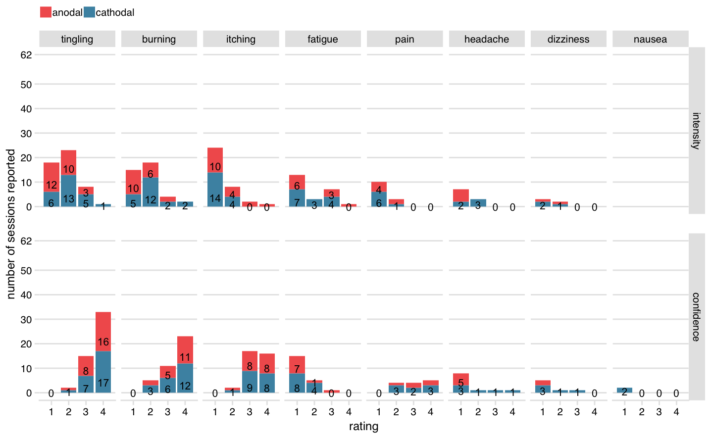

# (APPENDIX) Appendix {-}
\cleardoublepage
\phantomsection
\addcontentsline{toc}{part}{Appendices}
\appendixpage*

# Supplement to Chapter \@ref(sacc-tDCS) {#sacc-tDCS-supplement}

## tDCS adverse effects

(\#fig:fig-sacc-tDCS-AE)(ref:caption-fig-sacc-tDCS-AE)

(ref:caption-fig-sacc-tDCS-AE) __tDCS adverse effects__. Number of reports out of 62 sessions (either anodal or cathodal tDCS). Top row shows intensity ratings [_little, moderate, strong, very strong_]; bottom row shows participant's confidence that event was related to tDCS [_unlikely, possibly, likely, very likely_]. Adverse effects are sorted in descending order of number of reports (for very rare events (five reports or fewer for a given polarity), some text counts have been removed to prevent overlap).

<table class="table table-striped" style="margin-left: auto; margin-right: auto;">
<caption>(\#tab:tab-sacc-tDCS-AE)Number of reports of tDCS adverse effects</caption>
 <thead>
<tr>
<th style="border-bottom:hidden" colspan="1"></th>
<th style="border-bottom:hidden; padding-bottom:0; padding-left:3px;padding-right:3px;text-align: center; " colspan="5">
Intensity ratinga

</th>
<th style="border-bottom:hidden; padding-bottom:0; padding-left:3px;padding-right:3px;text-align: center; " colspan="5">
Confidence ratingb

</th>
</tr>
  <tr>
   <th style="text-align:left;">   </th>
   <th style="text-align:right;"> none </th>
   <th style="text-align:right;"> a little </th>
   <th style="text-align:right;"> moderate </th>
   <th style="text-align:right;"> strong </th>
   <th style="text-align:right;"> very strong </th>
   <th style="text-align:right;"> n/a </th>
   <th style="text-align:right;"> unlikely </th>
   <th style="text-align:right;"> possibly </th>
   <th style="text-align:right;"> likely </th>
   <th style="text-align:right;"> very likely </th>
  </tr>
 </thead>
<tbody>
  <tr grouplength="8"><td colspan="11" style="border-bottom: 1px solid;"><strong>anodal session</strong></td></tr>
<tr>
   <td style="text-align:left; padding-left: 2em;" indentlevel="1"> burning </td>
   <td style="text-align:right;"> 12 </td>
   <td style="text-align:right;"> 10 </td>
   <td style="text-align:right;"> 6 </td>
   <td style="text-align:right;"> 2 </td>
   <td style="text-align:right;"> 0 </td>
   <td style="text-align:right;"> 12 </td>
   <td style="text-align:right;"> 0 </td>
   <td style="text-align:right;"> 2 </td>
   <td style="text-align:right;"> 5 </td>
   <td style="text-align:right;"> 11 </td>
  </tr>
  <tr>
   <td style="text-align:left; padding-left: 2em;" indentlevel="1"> dizziness </td>
   <td style="text-align:right;"> 28 </td>
   <td style="text-align:right;"> 1 </td>
   <td style="text-align:right;"> 1 </td>
   <td style="text-align:right;"> 0 </td>
   <td style="text-align:right;"> 0 </td>
   <td style="text-align:right;"> 28 </td>
   <td style="text-align:right;"> 2 </td>
   <td style="text-align:right;"> 0 </td>
   <td style="text-align:right;"> 0 </td>
   <td style="text-align:right;"> 0 </td>
  </tr>
  <tr>
   <td style="text-align:left; padding-left: 2em;" indentlevel="1"> fatigue </td>
   <td style="text-align:right;"> 20 </td>
   <td style="text-align:right;"> 6 </td>
   <td style="text-align:right;"> 0 </td>
   <td style="text-align:right;"> 3 </td>
   <td style="text-align:right;"> 1 </td>
   <td style="text-align:right;"> 21 </td>
   <td style="text-align:right;"> 7 </td>
   <td style="text-align:right;"> 1 </td>
   <td style="text-align:right;"> 1 </td>
   <td style="text-align:right;"> 0 </td>
  </tr>
  <tr>
   <td style="text-align:left; padding-left: 2em;" indentlevel="1"> headache </td>
   <td style="text-align:right;"> 25 </td>
   <td style="text-align:right;"> 5 </td>
   <td style="text-align:right;"> 0 </td>
   <td style="text-align:right;"> 0 </td>
   <td style="text-align:right;"> 0 </td>
   <td style="text-align:right;"> 25 </td>
   <td style="text-align:right;"> 5 </td>
   <td style="text-align:right;"> 0 </td>
   <td style="text-align:right;"> 0 </td>
   <td style="text-align:right;"> 0 </td>
  </tr>
  <tr>
   <td style="text-align:left; padding-left: 2em;" indentlevel="1"> itching </td>
   <td style="text-align:right;"> 13 </td>
   <td style="text-align:right;"> 10 </td>
   <td style="text-align:right;"> 4 </td>
   <td style="text-align:right;"> 2 </td>
   <td style="text-align:right;"> 1 </td>
   <td style="text-align:right;"> 13 </td>
   <td style="text-align:right;"> 0 </td>
   <td style="text-align:right;"> 1 </td>
   <td style="text-align:right;"> 8 </td>
   <td style="text-align:right;"> 8 </td>
  </tr>
  <tr>
   <td style="text-align:left; padding-left: 2em;" indentlevel="1"> nausea </td>
   <td style="text-align:right;"> 30 </td>
   <td style="text-align:right;"> 0 </td>
   <td style="text-align:right;"> 0 </td>
   <td style="text-align:right;"> 0 </td>
   <td style="text-align:right;"> 0 </td>
   <td style="text-align:right;"> 30 </td>
   <td style="text-align:right;"> 0 </td>
   <td style="text-align:right;"> 0 </td>
   <td style="text-align:right;"> 0 </td>
   <td style="text-align:right;"> 0 </td>
  </tr>
  <tr>
   <td style="text-align:left; padding-left: 2em;" indentlevel="1"> pain </td>
   <td style="text-align:right;"> 24 </td>
   <td style="text-align:right;"> 4 </td>
   <td style="text-align:right;"> 2 </td>
   <td style="text-align:right;"> 0 </td>
   <td style="text-align:right;"> 0 </td>
   <td style="text-align:right;"> 25 </td>
   <td style="text-align:right;"> 0 </td>
   <td style="text-align:right;"> 1 </td>
   <td style="text-align:right;"> 2 </td>
   <td style="text-align:right;"> 2 </td>
  </tr>
  <tr>
   <td style="text-align:left; padding-left: 2em;" indentlevel="1"> tingling </td>
   <td style="text-align:right;"> 5 </td>
   <td style="text-align:right;"> 12 </td>
   <td style="text-align:right;"> 10 </td>
   <td style="text-align:right;"> 3 </td>
   <td style="text-align:right;"> 0 </td>
   <td style="text-align:right;"> 5 </td>
   <td style="text-align:right;"> 0 </td>
   <td style="text-align:right;"> 1 </td>
   <td style="text-align:right;"> 8 </td>
   <td style="text-align:right;"> 16 </td>
  </tr>
  <tr grouplength="8"><td colspan="11" style="border-bottom: 1px solid;"><strong>cathodal session</strong></td></tr>
<tr>
   <td style="text-align:left; padding-left: 2em;" indentlevel="1"> burning </td>
   <td style="text-align:right;"> 11 </td>
   <td style="text-align:right;"> 5 </td>
   <td style="text-align:right;"> 12 </td>
   <td style="text-align:right;"> 2 </td>
   <td style="text-align:right;"> 2 </td>
   <td style="text-align:right;"> 11 </td>
   <td style="text-align:right;"> 0 </td>
   <td style="text-align:right;"> 3 </td>
   <td style="text-align:right;"> 6 </td>
   <td style="text-align:right;"> 12 </td>
  </tr>
  <tr>
   <td style="text-align:left; padding-left: 2em;" indentlevel="1"> dizziness </td>
   <td style="text-align:right;"> 29 </td>
   <td style="text-align:right;"> 2 </td>
   <td style="text-align:right;"> 1 </td>
   <td style="text-align:right;"> 0 </td>
   <td style="text-align:right;"> 0 </td>
   <td style="text-align:right;"> 27 </td>
   <td style="text-align:right;"> 3 </td>
   <td style="text-align:right;"> 1 </td>
   <td style="text-align:right;"> 1 </td>
   <td style="text-align:right;"> 0 </td>
  </tr>
  <tr>
   <td style="text-align:left; padding-left: 2em;" indentlevel="1"> fatigue </td>
   <td style="text-align:right;"> 18 </td>
   <td style="text-align:right;"> 7 </td>
   <td style="text-align:right;"> 3 </td>
   <td style="text-align:right;"> 4 </td>
   <td style="text-align:right;"> 0 </td>
   <td style="text-align:right;"> 20 </td>
   <td style="text-align:right;"> 8 </td>
   <td style="text-align:right;"> 4 </td>
   <td style="text-align:right;"> 0 </td>
   <td style="text-align:right;"> 0 </td>
  </tr>
  <tr>
   <td style="text-align:left; padding-left: 2em;" indentlevel="1"> headache </td>
   <td style="text-align:right;"> 27 </td>
   <td style="text-align:right;"> 2 </td>
   <td style="text-align:right;"> 3 </td>
   <td style="text-align:right;"> 0 </td>
   <td style="text-align:right;"> 0 </td>
   <td style="text-align:right;"> 26 </td>
   <td style="text-align:right;"> 3 </td>
   <td style="text-align:right;"> 1 </td>
   <td style="text-align:right;"> 1 </td>
   <td style="text-align:right;"> 1 </td>
  </tr>
  <tr>
   <td style="text-align:left; padding-left: 2em;" indentlevel="1"> itching </td>
   <td style="text-align:right;"> 14 </td>
   <td style="text-align:right;"> 14 </td>
   <td style="text-align:right;"> 4 </td>
   <td style="text-align:right;"> 0 </td>
   <td style="text-align:right;"> 0 </td>
   <td style="text-align:right;"> 14 </td>
   <td style="text-align:right;"> 0 </td>
   <td style="text-align:right;"> 1 </td>
   <td style="text-align:right;"> 9 </td>
   <td style="text-align:right;"> 8 </td>
  </tr>
  <tr>
   <td style="text-align:left; padding-left: 2em;" indentlevel="1"> nausea </td>
   <td style="text-align:right;"> 32 </td>
   <td style="text-align:right;"> 0 </td>
   <td style="text-align:right;"> 0 </td>
   <td style="text-align:right;"> 0 </td>
   <td style="text-align:right;"> 0 </td>
   <td style="text-align:right;"> 30 </td>
   <td style="text-align:right;"> 2 </td>
   <td style="text-align:right;"> 0 </td>
   <td style="text-align:right;"> 0 </td>
   <td style="text-align:right;"> 0 </td>
  </tr>
  <tr>
   <td style="text-align:left; padding-left: 2em;" indentlevel="1"> pain </td>
   <td style="text-align:right;"> 25 </td>
   <td style="text-align:right;"> 6 </td>
   <td style="text-align:right;"> 1 </td>
   <td style="text-align:right;"> 0 </td>
   <td style="text-align:right;"> 0 </td>
   <td style="text-align:right;"> 24 </td>
   <td style="text-align:right;"> 0 </td>
   <td style="text-align:right;"> 3 </td>
   <td style="text-align:right;"> 2 </td>
   <td style="text-align:right;"> 3 </td>
  </tr>
  <tr>
   <td style="text-align:left; padding-left: 2em;" indentlevel="1"> tingling </td>
   <td style="text-align:right;"> 7 </td>
   <td style="text-align:right;"> 6 </td>
   <td style="text-align:right;"> 13 </td>
   <td style="text-align:right;"> 5 </td>
   <td style="text-align:right;"> 1 </td>
   <td style="text-align:right;"> 7 </td>
   <td style="text-align:right;"> 0 </td>
   <td style="text-align:right;"> 1 </td>
   <td style="text-align:right;"> 7 </td>
   <td style="text-align:right;"> 17 </td>
  </tr>
</tbody>
<tfoot>
<tr><td style="padding: 0; border: 0;" colspan="100%">
a "To which degree were the following sensations present during stimulation?"</td></tr>
<tr><td style="padding: 0; border: 0;" colspan="100%">
b "To which degree do you believe this was caused by the stimulation?"</td></tr>
</tfoot>
</table>

## MNI coordinates

| participant | X    | Y     | Z    |
|-------------|------|-------|------|
| 1           | 29.4 | 1.1   | 54.9 |
| 2           | 33.0 | -2.2  | 50.4 |
| 3           | 30.6 | -1.5  | 50.6 |
| 4           | 25.7 | -3.8  | 56.4 |
| 5           | 29.8 | -5.2  | 55.8 |
| 6           | 29.8 | -1.1  | 58.3 |
| 7           | 38.1 | 3.0   | 46.0 |
| 8           | 31.5 | 0.5   | 45.6 |
| 9           | 28.5 | 3.6   | 51.3 |
| 10          | 28.1 | -1.9  | 50.7 |
| 11          | 30.6 | -3.8  | 52.0 |
| 12          | 36.5 | -0.4  | 46.8 |
| 13          | 26.2 | -1.1  | 54.7 |
| 14          | 37.5 | -1.6  | 52.6 |
| 15          | 31.8 | -8.4  | 59.0 |
| 16          | 31.0 | -5.1  | 54.3 |
| 17          | 35.0 | 8.4   | 49.8 |
| 18          | 28.1 | -3.8  | 52.8 |
| 19          | 41.2 | -1.7  | 47.6 |
| 20          | 37.3 | -0.9  | 43.4 |
| 21          | 34.3 | -2.9  | 49.2 |
| 22          | 27.7 | -10.1 | 51.0 |
| 23          | 30.3 | -5.3  | 55.3 |
| 24          | 26.8 | -3.9  | 54.6 |
| 25          | 29.0 | 4.9   | 49.1 |
| 26          | 30.3 | -3.9  | 50.9 |

Table: (\#tab:MNI) __Individual MNI coordinates of the right frontal eye field.__

